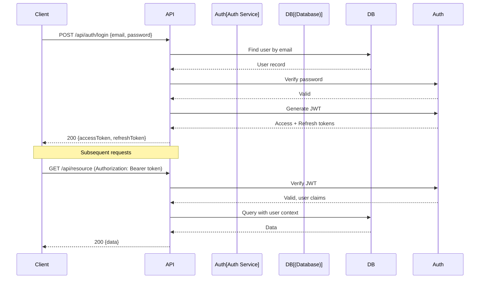
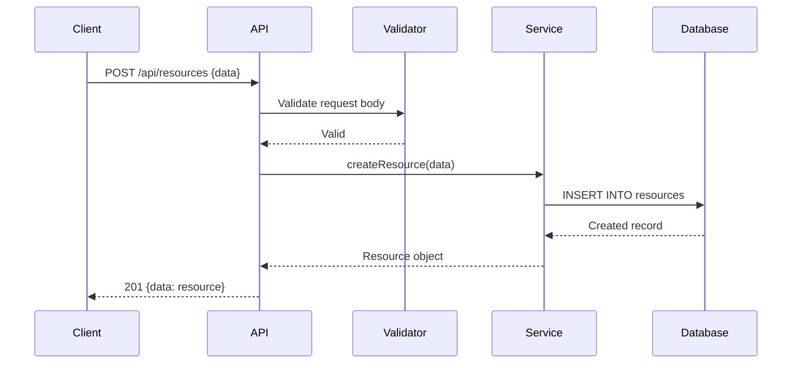

# API Reference

## Overview

<!-- API style (REST, GraphQL), versioning strategy, content type -->

## Authentication

<!-- Auth mechanism: JWT, API key, OAuth2, session-based -->



<!-- Replace with actual auth flow -->

## Base URLs

| Environment | URL | Notes |
|-------------|-----|-------|
| Development | `http://localhost:3000/api` | Local dev server |
| Staging | `{{STAGING_URL}}/api` | Pre-production |
| Production | `{{PRODUCTION_URL}}/api` | Live |

## Request/Response Standards

### Headers

| Header | Value | Required |
|--------|-------|----------|
| `Content-Type` | `application/json` | Yes (POST/PUT) |
| `Authorization` | `Bearer <token>` | Yes (protected routes) |
| `Accept` | `application/json` | Recommended |

### Response Format

**Success:**
```json
{
  "data": { ... },
  "meta": {
    "page": 1,
    "pageSize": 20,
    "total": 150
  }
}
```

**Error:**
```json
{
  "error": {
    "code": "VALIDATION_ERROR",
    "message": "Human-readable message",
    "details": [
      { "field": "email", "message": "Invalid email format" }
    ]
  }
}
```

## Endpoints

### Authentication

| Method | Path | Description | Auth | Request Body | Response |
|--------|------|-------------|------|-------------|----------|
| POST | `/api/auth/login` | User login | No | `{email, password}` | `{accessToken, refreshToken}` |
| POST | `/api/auth/register` | User registration | No | `{email, password, name}` | `{user, accessToken}` |
| POST | `/api/auth/refresh` | Refresh token | No | `{refreshToken}` | `{accessToken}` |
| POST | `/api/auth/logout` | Logout | Yes | — | `204 No Content` |

<!-- Replace with actual endpoints -->

### Resources (CRUD Example)



| Method | Path | Description | Auth | Request | Response |
|--------|------|-------------|------|---------|----------|
| GET | `/api/resources` | List all | Yes | Query: `?page=1&limit=20&search=` | `{data: [...], meta: {...}}` |
| GET | `/api/resources/:id` | Get one | Yes | — | `{data: resource}` |
| POST | `/api/resources` | Create | Yes | `{name, description, ...}` | `{data: resource}` |
| PUT | `/api/resources/:id` | Update | Yes | `{name?, description?, ...}` | `{data: resource}` |
| DELETE | `/api/resources/:id` | Delete | Yes | — | `204 No Content` |

<!-- Replace with actual resource endpoints -->

## Error Codes

| HTTP Status | Error Code | Meaning | Common Causes |
|-------------|-----------|---------|---------------|
| 400 | `VALIDATION_ERROR` | Invalid input | Missing fields, wrong format |
| 401 | `UNAUTHORIZED` | Not authenticated | Missing/expired token |
| 403 | `FORBIDDEN` | Not authorized | Insufficient permissions |
| 404 | `NOT_FOUND` | Resource not found | Invalid ID, deleted resource |
| 409 | `CONFLICT` | Duplicate resource | Unique constraint violation |
| 422 | `UNPROCESSABLE` | Business rule violation | Invalid state transition |
| 429 | `RATE_LIMITED` | Too many requests | Rate limit exceeded |
| 500 | `INTERNAL_ERROR` | Server error | Unhandled exception |

## Rate Limiting

| Endpoint Group | Limit | Window | Response Header |
|---------------|-------|--------|----------------|
| Auth endpoints | 10 req | 1 min | `X-RateLimit-Remaining` |
| API endpoints | 100 req | 1 min | `X-RateLimit-Remaining` |

<!-- Replace with actual rate limits -->

## Pagination

```
GET /api/resources?page=2&limit=20&sort=created_at&order=desc
```

| Parameter | Type | Default | Description |
|-----------|------|---------|-------------|
| `page` | int | 1 | Page number |
| `limit` | int | 20 | Items per page (max 100) |
| `sort` | string | `created_at` | Sort field |
| `order` | string | `desc` | Sort direction: `asc` or `desc` |

## Webhooks (if applicable)

<!-- Document any webhook endpoints the system sends or receives -->
