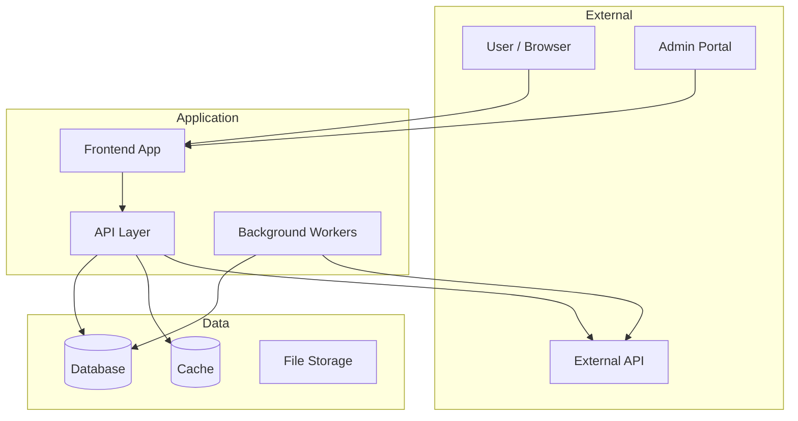
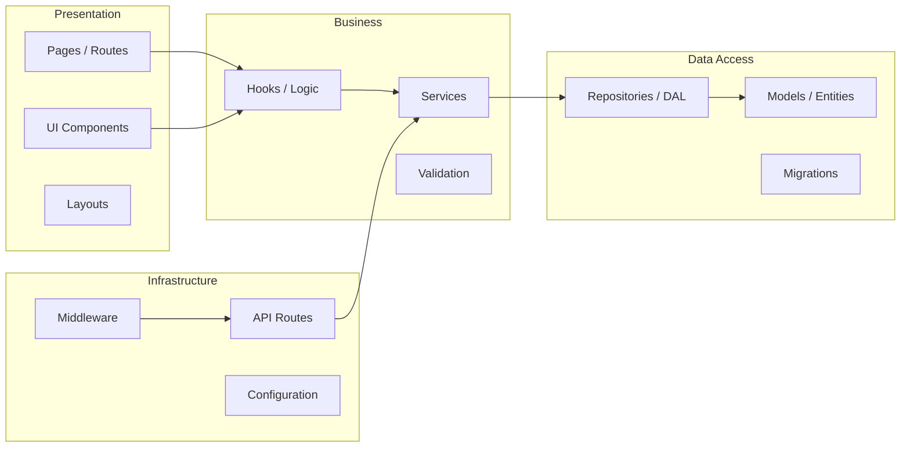
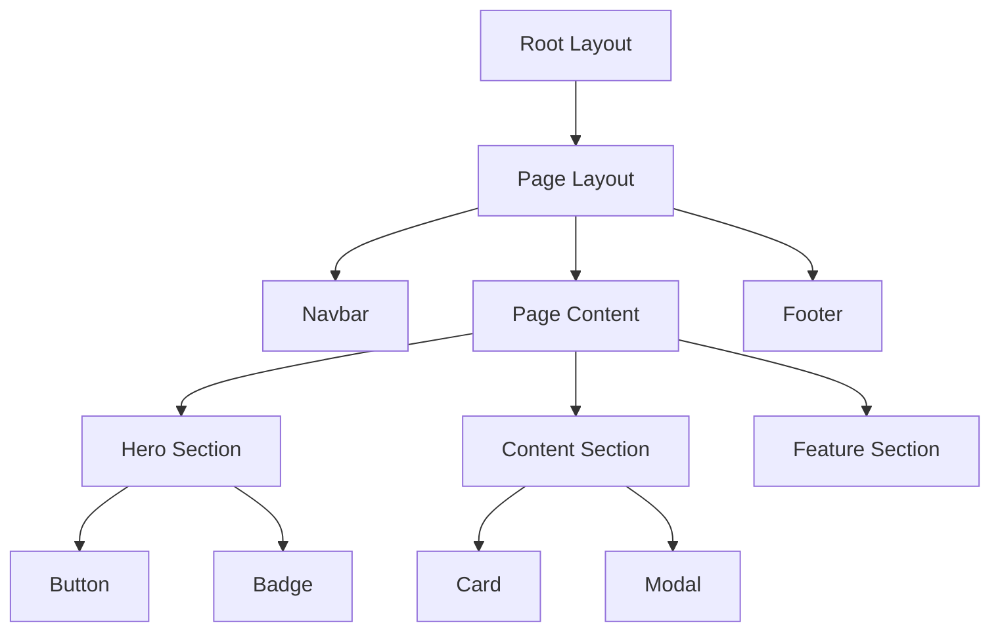
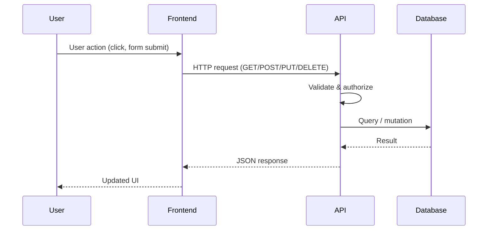
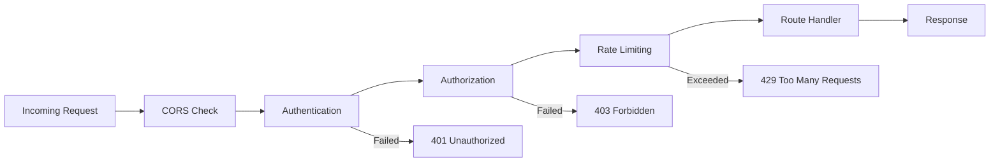

# Architecture

## Overview

<!-- One paragraph: what the system does, who uses it, what problem it solves -->

## System Architecture Diagram

<!-- High-level system context showing external actors and systems -->

<!-- Replace with actual system components -->

## Application Layers

<!-- Replace with actual layer structure -->

## Layer Responsibilities

| Layer | Responsibility | Key Patterns | Location |
|-------|---------------|-------------|----------|
| **Presentation** | UI rendering, user interaction, routing | Server/Client components, layouts | `src/app/`, `src/components/` |
| **Business Logic** | Domain rules, data transformation, orchestration | Services, hooks, validation | `src/lib/`, `src/hooks/` |
| **Data Access** | Database queries, ORM operations, caching | Repository pattern, Prisma/EF Core | `src/models/`, `prisma/` |
| **Infrastructure** | API routes, middleware, auth, config | Route handlers, middleware chain | `src/app/api/`, `src/middleware.ts` |

<!-- Replace with actual layers -->

## Component Hierarchy

<!-- Replace with actual component tree -->

## Data Flow

<!-- Replace with actual data flow for key operations -->

## Technology Stack

| Component | Technology | Version | Purpose |
|-----------|-----------|---------|---------|
| Runtime | Node.js | v20.x | Server-side execution |
| Framework | Next.js | 14.x | Full-stack React framework |
| Language | TypeScript | 5.x | Type-safe development |
| Styling | Tailwind CSS | 3.x | Utility-first CSS |
| Database | PostgreSQL | 15.x | Relational data store |
| ORM | Prisma | 5.x | Database access & migrations |
| Testing | Vitest + Playwright | latest | Unit + E2E testing |

<!-- Replace with actual stack -->

## Key Patterns & Conventions

| Pattern | Where Used | Example |
|---------|-----------|---------|
| Server Components | Default for all pages/layouts | `src/app/page.tsx` |
| Client Components | Interactive UI only | `'use client'` directive |
| Repository Pattern | Data access layer | `src/lib/repositories/` |
| Middleware Chain | Auth, logging, CORS | `src/middleware.ts` |
| Error Boundaries | Graceful error handling | `error.tsx` per route |

<!-- Replace with actual patterns -->

## External Dependencies

| Service | Purpose | Integration Point | Docs |
|---------|---------|-------------------|------|
| GitHub Actions | CI/CD, pull requests | Workflow files + REST API | `docs/deployment.md` |

<!-- Add actual external services -->

## Security Architecture

<!-- Replace with actual security flow -->
