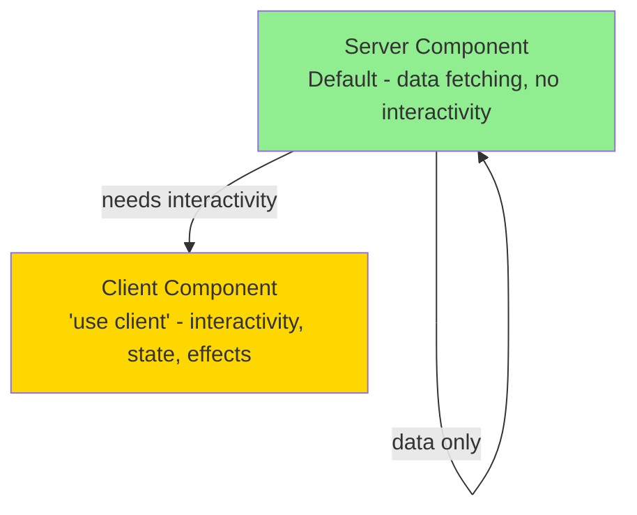
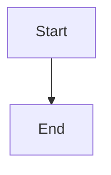

# Conventions

## Overview

<!-- Team coding standards, agreed-upon patterns, and workflow rules -->

## Naming Conventions

| Element | Convention | Example |
|---------|-----------|---------|
| Files (components) | PascalCase | `UserProfile.tsx` |
| Files (utilities) | camelCase | `formatDate.ts` |
| Files (tests) | match source + `.test` | `UserProfile.test.tsx` |
| Directories | kebab-case | `user-management/` |
| React Components | PascalCase | `function UserCard()` |
| Functions | camelCase | `function calculateTotal()` |
| Variables | camelCase | `const userName = ...` |
| Constants | SCREAMING_SNAKE | `const MAX_RETRIES = 3` |
| Types/Interfaces | PascalCase | `interface UserProfile` |
| Enums | PascalCase members | `enum Status { Active, Inactive }` |
| Database tables | snake_case, plural | `user_profiles` |
| Database columns | snake_case | `created_at` |
| API endpoints | kebab-case | `/api/user-profiles` |
| CSS classes | Tailwind utilities | `className="flex items-center"` |
| Environment variables | SCREAMING_SNAKE | `DATABASE_URL` |

<!-- Replace with actual conventions -->

## Code Patterns

### Component Pattern



| Pattern | When to use | Example |
|---------|------------|---------|
| Server Component | Default — data fetching, static rendering | Pages, layouts, data display |
| Client Component | User interaction, state, browser APIs | Forms, modals, animations |
| Custom Hook | Reusable stateful logic | `useDebounce`, `useAuth` |
| Service Function | Business logic, API calls | `userService.create()` |
| Utility Function | Pure data transformation | `formatCurrency()` |

<!-- Replace with actual patterns -->

### Error Handling Pattern

```typescript
// API route error handling
try {
  const result = await service.operation(input);
  return Response.json({ data: result });
} catch (error) {
  if (error instanceof ValidationError) {
    return Response.json({ error: { code: 'VALIDATION_ERROR', message: error.message } }, { status: 400 });
  }
  if (error instanceof NotFoundError) {
    return Response.json({ error: { code: 'NOT_FOUND', message: error.message } }, { status: 404 });
  }
  console.error('Unexpected error:', error);
  return Response.json({ error: { code: 'INTERNAL_ERROR', message: 'An unexpected error occurred' } }, { status: 500 });
}
```

<!-- Replace with actual error handling pattern -->

## Git Conventions

### Branch Naming

```mermaid
gitgraph
    commit id: "initial"
    branch develop
    checkout develop
    commit id: "setup"
    branch feature/user-auth
    checkout feature/user-auth
    commit id: "add login"
    commit id: "add tests"
    checkout develop
    merge feature/user-auth
    branch staging
    checkout staging
    commit id: "staging deploy"
    checkout main
    merge staging tag: "v1.0.0"
```

| Branch Type | Pattern | Example | From |
|------------|---------|---------|------|
| Feature | `feature/<description>` | `feature/user-authentication` | `develop` |
| Bug fix | `fix/<description>` | `fix/login-validation` | `develop` |
| Hotfix | `hotfix/<description>` | `hotfix/payment-crash` | `master` |
| Release | `staging` | — | `develop` merge |

### Commit Messages

Format: `type(scope): description`

| Type | When | Example |
|------|------|---------|
| `feat` | New feature | `feat(auth): add OAuth2 login` |
| `fix` | Bug fix | `fix(cart): correct total calculation` |
| `docs` | Documentation | `docs(api): update endpoint docs` |
| `refactor` | Code refactor | `refactor(db): simplify query builder` |
| `test` | Add/update tests | `test(auth): add login integration tests` |
| `chore` | Maintenance | `chore(deps): update dependencies` |
| `style` | Formatting only | `style: fix indentation` |
| `perf` | Performance | `perf(query): add database index` |

### Pull Request Rules

- **Title**: Same format as commits (`type(scope): description`)
- **Description**: What, why, how to test
- **Reviewers**: At least 1 approval required
- **CI**: All checks must pass before merge
- **Merge**: Squash merge to keep history clean

## Coding Standards

### TypeScript

- Strict mode enabled (`strict: true` in tsconfig)
- No `any` types — use `unknown` or proper types
- Prefer `interface` over `type` for object shapes
- Use `const` by default, `let` when needed, never `var`

### React

- Functional components only (no class components)
- Custom hooks for shared logic
- Props destructured in function signature
- No inline styles — use Tailwind utilities

### Testing

- Follow TDD: test first, then implement
- Test behavior, not implementation
- One assertion focus per test (multiple `expect` OK if same behavior)
- Use descriptive test names: "should [behavior] when [condition]"

### CSS / Styling

- Tailwind utilities for all styling
- `cn()` helper for conditional classes
- CSS variables for theme values
- Responsive: mobile-first breakpoints

<!-- Replace with actual coding standards -->

## Documentation Conventions

### Mermaid Diagrams

Use standard fenced code blocks with the `mermaid` language tag.

```

```

### Documentation Page Structure

Every docs page follows the same frontmatter pattern:

```yaml
---
title: Page Title
last_updated: YYYY-MM-DD
status: template | draft | reviewed
---
```

- `template` — placeholder content from scaffolding
- `draft` — auto-generated from codebase analysis (via `/wiki auto` or `/wiki update`)
- `reviewed` — manually verified by a developer

## Code Review Checklist

- [ ] Follows naming conventions
- [ ] Has tests (unit + integration if applicable)
- [ ] No hardcoded values (use constants/env vars)
- [ ] Error handling follows project pattern
- [ ] TypeScript types are explicit (no `any`)
- [ ] Accessibility: proper ARIA attributes, keyboard navigation
- [ ] Documentation updated if API changed
