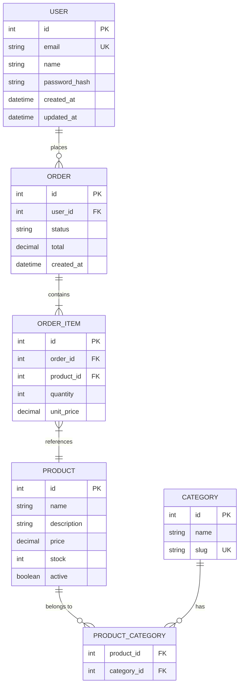
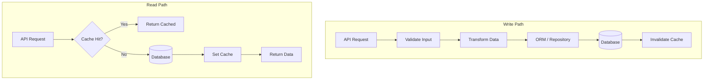

# Data Model

## Overview

<!-- Database technology, hosting, and access pattern summary -->

## Entity Relationship Diagram



<!-- Replace with actual entities and relationships -->

## Entities

### User

| Field | Type | Constraints | Description |
|-------|------|-------------|-------------|
| `id` | int | PK, auto-increment | Unique identifier |
| `email` | string(255) | Unique, NOT NULL | Login email |
| `name` | string(100) | NOT NULL | Display name |
| `password_hash` | string(255) | NOT NULL | Bcrypt hash |
| `role` | enum | DEFAULT 'user' | user, admin, moderator |
| `created_at` | datetime | DEFAULT NOW() | Account creation time |
| `updated_at` | datetime | ON UPDATE NOW() | Last modification |

**Relationships:**
- Has many `Orders`
- Has many `Sessions`

**Indexes:**
- `idx_user_email` on `email` (unique)
- `idx_user_created` on `created_at`

<!-- Replace with actual entities — one subsection per entity -->

## Relationship Matrix

| From | To | Type | FK Column | On Delete |
|------|----|------|-----------|-----------|
| User | Order | 1:N | `order.user_id` | CASCADE |
| Order | OrderItem | 1:N | `order_item.order_id` | CASCADE |
| OrderItem | Product | N:1 | `order_item.product_id` | RESTRICT |
| Product | Category | N:N | via `product_category` | CASCADE |

<!-- Replace with actual relationships -->

## Data Flow Diagram



<!-- Replace with actual data flow -->

## Migrations

### How to Create a Migration

```bash
# Generate migration from schema changes
npx prisma migrate dev --name description_of_change

# Apply migrations to staging/production
npx prisma migrate deploy
```

<!-- Replace with actual migration commands for your ORM -->

### Migration History

| Migration | Date | Description |
|-----------|------|-------------|
| `001_initial` | YYYY-MM-DD | Initial schema with core entities |

<!-- Replace with actual migration history -->

## Seed Data

```bash
# Run seed script
npx prisma db seed
```

<!-- Document what seed data exists and how to use it -->

## Database Conventions

| Convention | Rule | Example |
|-----------|------|---------|
| Table names | plural, snake_case | `order_items` |
| Column names | snake_case | `created_at` |
| Primary keys | `id` (auto-increment) | `id SERIAL PRIMARY KEY` |
| Foreign keys | `{table}_id` | `user_id` |
| Timestamps | Always include | `created_at`, `updated_at` |
| Soft delete | Use `deleted_at` | `deleted_at TIMESTAMP NULL` |
| Indexes | On FKs and search columns | `idx_{table}_{column}` |

<!-- Replace with actual conventions -->
