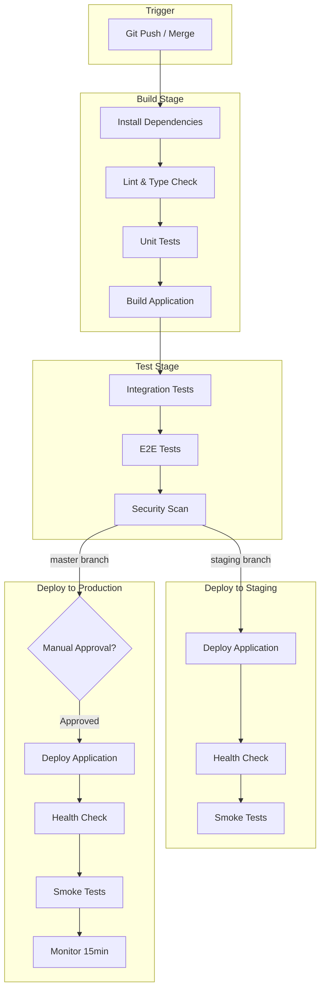
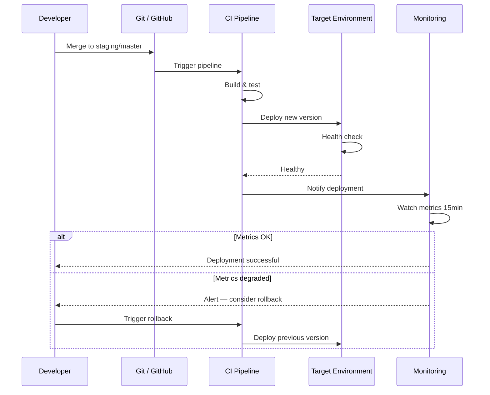
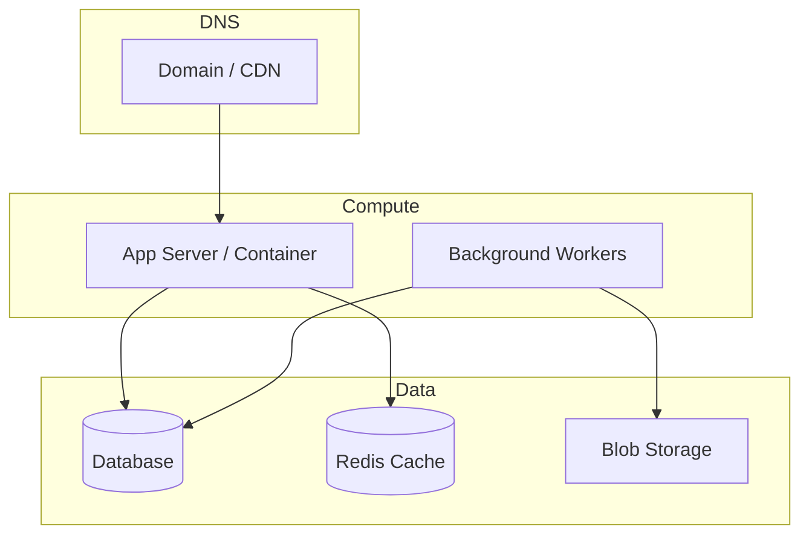

# Deployment

## Overview

<!-- Deployment strategy, zero-downtime approach, infrastructure summary -->

## Environments

| Environment | Branch | URL | Deploy Target | Auto-Deploy |
|-------------|--------|-----|--------------|-------------|
| Development | `develop` | `localhost:3000` | Local | — |
| Staging | `staging` | {{STAGING_URL}} | {{DEPLOY_TARGET}} | On merge |
| Production | `master` | {{PRODUCTION_URL}} | {{DEPLOY_TARGET}} | On merge |

## CI/CD Pipeline



<!-- Replace with actual pipeline -->

### Pipeline Triggers

| Branch | Pipeline | Action |
|--------|----------|--------|
| `feature/*` | CI only | Build + test, no deploy |
| `staging` | CI + CD | Build + test + deploy to staging |
| `master` | CI + CD | Build + test + deploy to production |

## Deployment Process



<!-- Replace with actual deployment process -->

## Infrastructure



<!-- Replace with actual infrastructure -->

## Rollback Procedure

### Automated Rollback

```bash
# Revert to previous deployment
# (command depends on deploy target)
```

### Manual Rollback

1. Identify the last working commit: `git log --oneline -5`
2. Create hotfix branch: `git checkout -b hotfix/rollback master`
3. Revert the problematic commit: `git revert <sha>`
4. Push and let pipeline deploy: `git push origin hotfix/rollback`
5. Merge to master after verification

### Rollback Decision Matrix

| Symptom | Severity | Action |
|---------|----------|--------|
| 5xx error rate > 1% | Critical | Immediate rollback |
| Response time > 2x baseline | High | Rollback within 15 min |
| Feature bug, no data loss | Medium | Hotfix forward |
| UI cosmetic issue | Low | Fix in next release |

## Environment-Specific Configuration

| Config | Staging | Production |
|--------|---------|-----------|
| Debug mode | Enabled | Disabled |
| Log level | Debug | Warning |
| Rate limiting | Relaxed | Strict |
| SSL | Required | Required |

<!-- Replace with actual environment config -->
