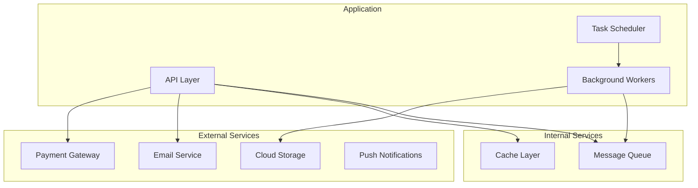
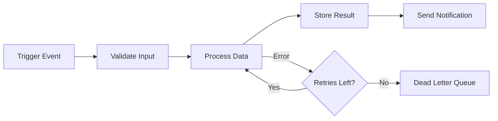
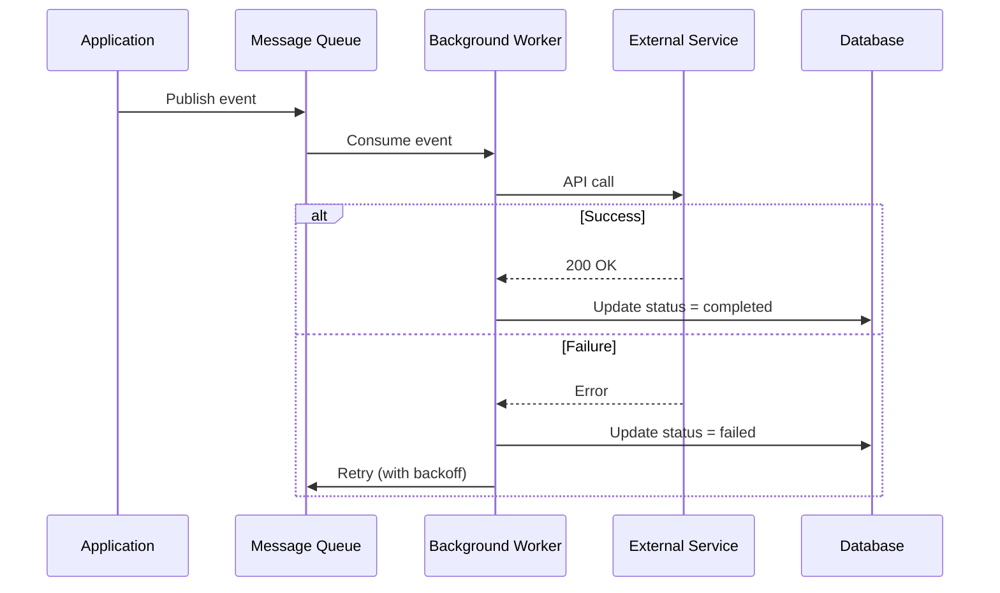

# Services & Integrations

## Overview

<!-- Summary of background services, external integrations, and their purposes -->

## Service Architecture

<!-- Replace with actual service architecture -->

## Internal Services

### Service Name

| Property | Value |
|----------|-------|
| **Purpose** | What this service does |
| **Location** | `src/services/service-name.ts` |
| **Dependencies** | Database, Cache |
| **Trigger** | API call / Scheduled / Event-driven |
| **Error Handling** | Retry 3x, then dead-letter queue |

<!-- Replace with actual services — one subsection per service -->

## External Integrations

| Service | Purpose | Protocol | Auth | Rate Limit |
|---------|---------|----------|------|-----------|
| SendGrid | Transactional email | REST API | API Key | 100/sec |
| Stripe | Payment processing | REST API | Secret Key | 100/sec |
| S3 / Blob | File storage | SDK | Access Key | N/A |

<!-- Replace with actual integrations -->

### Integration Flow Example

<!-- Replace with actual integration flow -->

## Background Jobs

| Job | Schedule | Purpose | Timeout | Monitoring |
|-----|----------|---------|---------|-----------|
| Cleanup expired sessions | Every hour | Remove old sessions | 5 min | Log count |
| Send digest emails | Daily 8am | User email digests | 30 min | Alert on failure |

<!-- Replace with actual background jobs -->

## Health Checks

| Endpoint | Checks | Expected |
|----------|--------|----------|
| `GET /api/health` | API availability | `200 {status: "ok"}` |
| `GET /api/health/db` | Database connectivity | `200 {status: "ok", latency: "5ms"}` |

<!-- Replace with actual health checks -->
