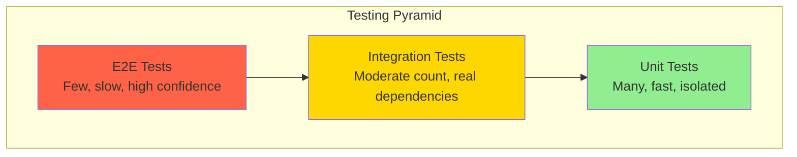
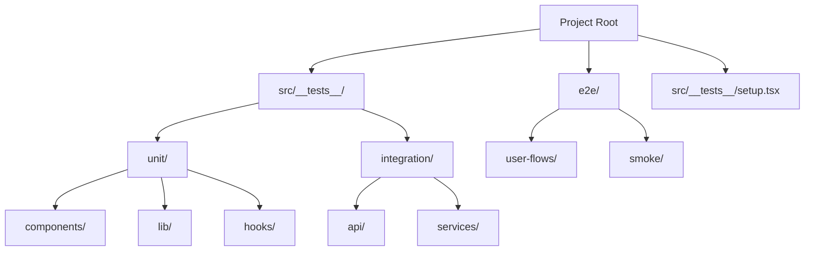
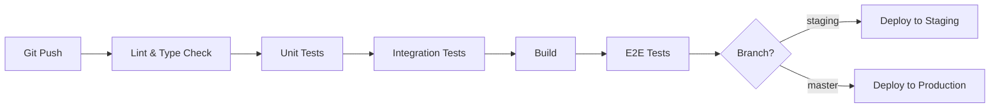

# Testing

## Strategy

<!-- Testing philosophy and pyramid -->



| Level | Count | Speed | What it tests | Tools |
|-------|-------|-------|---------------|-------|
| **Unit** | Many | Fast (<1s) | Individual functions, components | Vitest, Jest |
| **Integration** | Moderate | Medium (1-10s) | Component interactions, API routes | Vitest, Supertest |
| **E2E** | Few | Slow (10-60s) | Full user flows | Playwright |

<!-- Replace with actual strategy -->

## Running Tests

| Action | Command | When |
|--------|---------|------|
| All unit tests | `npm test` | Before commit |
| Single test file | `npm test -- path/to/test.ts` | During development |
| Watch mode | `npm test -- --watch` | During development |
| With coverage | `npm test -- --coverage` | Before PR |
| E2E tests | `npm run test:e2e` | Before merge |
| E2E headed (debug) | `npm run test:e2e -- --headed` | Debugging failures |

<!-- Replace with actual commands -->

## Test Structure



| Directory | Purpose | Naming Pattern |
|-----------|---------|---------------|
| `src/__tests__/unit/` | Unit tests | `*.test.ts`, `*.test.tsx` |
| `src/__tests__/integration/` | Integration tests | `*.integration.test.ts` |
| `e2e/` | End-to-end tests | `*.spec.ts` |
| `src/__tests__/setup.tsx` | Global test setup | — |
| `src/__tests__/__mocks__/` | Shared mocks | `*.mock.ts` |

<!-- Replace with actual test structure -->

## Test Patterns

### Unit Test Pattern

```typescript
// Component test example
describe('ComponentName', () => {
  it('should render correctly with default props', () => {
    const { getByText } = render(<ComponentName />);
    expect(getByText('Expected Text')).toBeInTheDocument();
  });

  it('should handle user interaction', async () => {
    const onAction = vi.fn();
    const { getByRole } = render(<ComponentName onAction={onAction} />);
    await userEvent.click(getByRole('button'));
    expect(onAction).toHaveBeenCalledOnce();
  });
});
```

### API Route Test Pattern

```typescript
// API integration test example
describe('GET /api/resources', () => {
  it('should return paginated results', async () => {
    // Arrange: seed database
    await db.resource.createMany({ data: testResources });

    // Act: call API
    const response = await fetch('/api/resources?page=1&limit=10');
    const body = await response.json();

    // Assert
    expect(response.status).toBe(200);
    expect(body.data).toHaveLength(10);
    expect(body.meta.total).toBe(testResources.length);
  });
});
```

### E2E Test Pattern

```typescript
// User flow E2E test
test('user can complete checkout flow', async ({ page }) => {
  await page.goto('/products');
  await page.click('[data-testid="product-card"]');
  await page.click('[data-testid="add-to-cart"]');
  await page.goto('/checkout');
  await page.fill('[name="email"]', 'test@example.com');
  await page.click('[data-testid="submit-order"]');
  await expect(page.locator('.order-confirmation')).toBeVisible();
});
```

<!-- Replace with actual patterns from the project -->

## Mocking Patterns

| What to mock | How | When |
|-------------|-----|------|
| External APIs | `vi.mock()` with response fixtures | Unit tests |
| Database | Test database with seed data | Integration tests |
| Auth | Mock JWT/session middleware | API route tests |
| Date/Time | `vi.useFakeTimers()` | Time-dependent logic |
| File system | `memfs` or `vi.mock('fs')` | File operations |

<!-- Replace with actual mocking patterns -->

## Coverage Targets

| Type | Target | Current | Measured By |
|------|--------|---------|-------------|
| Unit | 80% | — | `vitest --coverage` |
| Integration | Key paths | — | `vitest --coverage` |
| E2E | Critical flows | — | Playwright report |

## CI Pipeline Testing



<!-- Replace with actual CI testing flow -->
